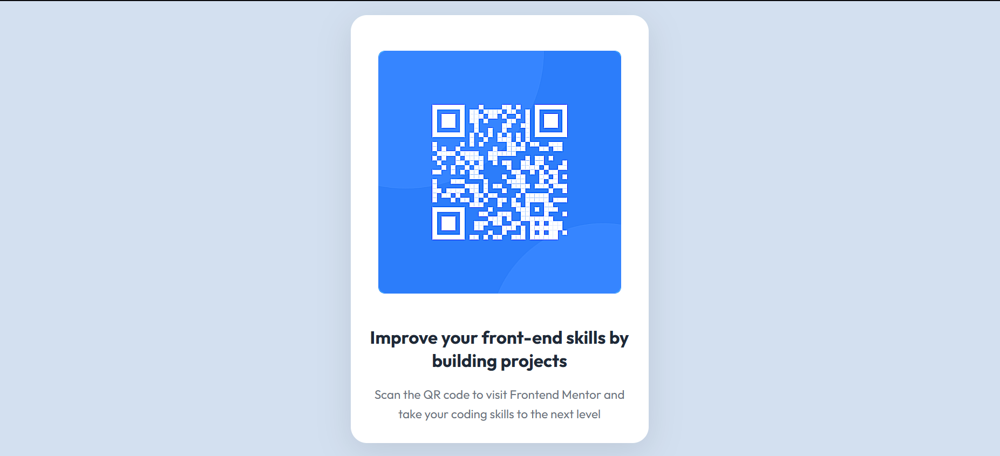

Este proyecto consiste en el desarrollo de un **componente de Código QR** utilizando **Astro** y **Tailwind CSS**.  
El objetivo es aplicar los conocimientos sobre **componentes**, **maquetación**, **estilos responsivos** y **utilidades CSS** para construir un diseño limpio, moderno y adaptable a diferentes dispositivos.

---

## 📖 Descripción general

### 🧩 Vista previa del proyecto
Componente QR responsivo y moderno desarrollado con Astro y Tailwind CSS. El diseño se adapta perfectamente a dispositivos móviles, tablets y pantallas de escritorio.

---

### 🔗 Enlaces del proyecto

- **Repositorio en GitHub:** 
https://github.com/AresGodKiller/QR_Code_Component 
- **Sitio desplegado:** 
https://qr-code-component-pied-beta.vercel.app

---

## 🧠 Proceso de desarrollo

### 🛠️ Tecnologías utilizadas
Lista las herramientas y tecnologías que utilizaste en el proyecto. Por ejemplo:

- [Astro](https://astro.build)
- [Tailwind CSS](https://tailwindcss.com/)
- HTML5 semántico
- Diseño responsivo (Mobile-first)
- Componentes reutilizables

---

### 💡 Lo que aprendí

En este proyecto reforcé y aprendí varios conceptos clave:

1. **Componentes reutilizables en Astro**: Crear componentes modulares que pueden adaptarse a diferentes contextos y props.

2. **Utilities-first con Tailwind CSS**: Utilizar clases utilitarias para construir diseños complejos sin escribir CSS personalizado.

3. **Diseño responsivo mobile-first**: Priorizar la experiencia en dispositivos móviles e ir escalando hacia pantallas más grandes.

4. **Layout y espaciado**: Usar propiedades como `padding`, `margin` y `gap` para crear composiciones visuales equilibradas.

### 🚀 Áreas de mejora

- **Animaciones interactivas**: Agregar transiciones suaves cuando el usuario interactúa con el componente.
- **Temas personalizados**: Implementar un sistema de temas (claro/oscuro) usando CSS variables de Tailwind.
- **Validación de QR**: Integrar validación para asegurar que los códigos QR sean válidos.
- **Generador dinámico**: Permitir que los usuarios generen sus propios códigos QR con entrada de texto.
- **Accesibilidad mejorada**: Añadir más atributos ARIA y mejorar el contraste de colores.
- **Testing**: Implementar tests unitarios para el componente.  

---

### 📚 Recursos útiles

- [Documentación de Astro](https://docs.astro.build) — Guía completa sobre componentes y estructura de proyectos
- [Guía oficial de Tailwind CSS](https://tailwindcss.com/docs) — Referencia de clases utilitarias y configuración
- [MDN Web Docs - HTML y CSS](https://developer.mozilla.org/es/) — Conceptos fundamentales de HTML semántico y CSS
- [Guía de diseño responsivo](https://web.dev/responsive-web-design-basics/) — Mejores prácticas para diseño mobile-first
- [QR Code API](https://qr-server.com/) — Servicio para generar códigos QR dinámicamente
- [Frontend Mentor](https://www.frontendmentor.io/) — Desafíos de diseño y maquetación  

---

### 👩‍💻 Autor

- **Nombre completo:** Eduardo Cadengo López
- **Carrera:** TIC's
- **Grupo:** 11:00 am
- **Correo institucional:** 23151204@aguascalientes.tecnm.mx

---

### ✨ Reflexión final

Este proyecto fue una excelente oportunidad para consolidar mis conocimientos en Astro y Tailwind CSS. 

**Lo más fácil**: Implementar el diseño responsivo fue directo gracias a las clases utilitarias de Tailwind.

**Lo más desafiante**: Conseguir el equilibrio perfecto entre estética y funcionalidad, asegurándome de que el componente fuera verdaderamente accesible.

**Lo que más disfruté**: Ver cómo un simple componente QR podía convertirse en un elemento visual atractivo y completamente funcional con las herramientas adecuadas.

**Aplicación futura**: Expandiré estos conocimientos para crear sistemas de componentes más complejos, exploraré las capacidades de integración de Astro con APIs externas, y continuaré mejorando la accesibilidad en mis proyectos.